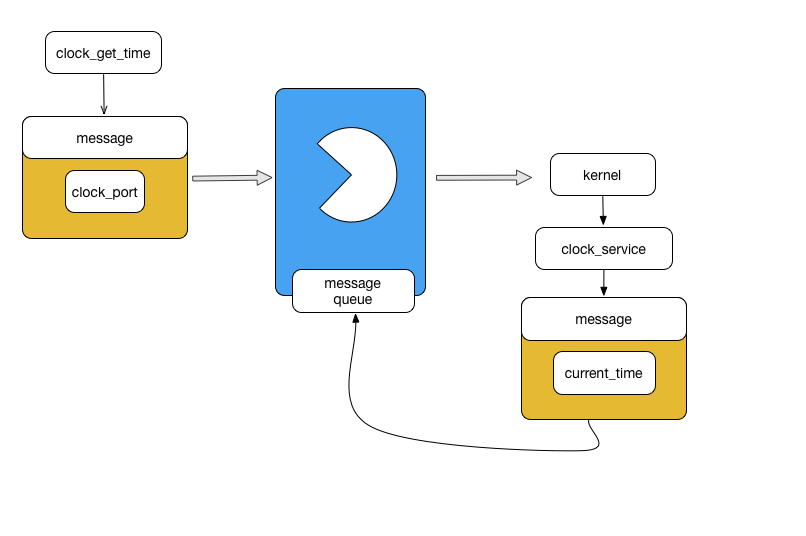

<h2>Missed OS X clocks guide

**Introduction**

This is a story of a little fight with non-clear OS X clock API.

When it comes to high-resolution time management in OS X wouldn't it be
a dreamy easily implement following routines:
- Receive current monotonically incrementing time value.
- Sleep for a specified interval.
- Sleep until a specified time.

It's probably nothing but a fantasy.

**Main part**

Linux provides following routines for high resolution clock management:
- [clock_nanosleep](http://man7.org/linux/man-pages/man2/clock_nanosleep.2.html)
- [nanosleep](http://man7.org/linux/man-pages/man2/nanosleep.2.html)

You probably shouldn't be afraid if `clock_nanosleep` isn't implemented on
your system, you can use [gettimeofday](http://man7.org/linux/man-pages/man2/gettimeofday.2.html)
+ nanosleep, but you'll lose a precision and the monotony because of gettimeofday.
You should test it first and maybe it will be acceptable in your case.

As you remember this article isn't about Linux and to figure out how OS X clock
API actually works, we need to dig into OS X architecture a little.

**Mach OS X Kernel overview**

[XNU](https://en.wikipedia.org/wiki/XNU) (X is not UNIX) is OS X kernel.
It is constructed from two distinct parts: BSD interface used to build
POSIX API; Mach interface to handle processes, threads, virtual memory, and
scheduling. XNU is a [hybrid kernel](https://en.wikipedia.org/wiki/Hybrid_kernel).

Mach kernel was heavily reworked in release 3 (1993) and became a pure kernel,
moving the BSD part into user space. Excluding UNIX-specific code from the
kernel allows to easily replace BSD with another operating system or even
running several ~~Linux~~ operating system interfaces simultaneously on the top
of the Mach kernel.

Mach design is all about IPC (inter-process communication mechanism), it is
called Mach Ports. Whatever you want to use some kernel facilities or user
space facilities, you need to send a message to some port. Mach ensures
security by requiring that message senders and receivers have rights.
Right consists of a port name and a capability—send or receive—on that port,
and is much like a capability in object-oriented systems. Only one task may
have receive-rights to any given port, but many tasks may have send-rights.
It's very similar to a Linux file descriptor.

As was mentioned before, OS X doesn't provide a mechanism to receive current
monotonically increasing time value. By exploring [man pages in XNU repository](https://github.com/opensource-apple/xnu/tree/10.12/osfmk/man),
we can figure out, that Mach API has something called clock_service.

Let's explore what we can do with it.

```C

#include <mach/mach.h>      /* host_get_clock_service */
#include <mach/clock.h>     /* clock_get_time */
#include <mach/mach_error.h> /* error handling */

kern_return_t err = KERN_SUCCESS;
clock_serv_t host_clock;

// SYSTEM_CLOCK stands for a time since a boot time. It has the same
// semantic as CLOCK_MONOTONIC.
// function returns a send right to a kernel clock's service port.
err = host_get_clock_service(mach_host_self(), SYSTEM_CLOCK, &host_clock);
if (err != KERN_SUCCESS) {
    mach_error("host_get_clock_service: ", err);
    exit(EXIT_FAILURE);
}

// struct mach_timespec {
//    unsigned int  tv_sec;         /* seconds */
//    clock_res_t   tv_nsec;    /* nanoseconds */
// };
// typedef struct mach_timespec mach_timespec_t;
//
// As you can see, mach_timespec_t is the same as timespec in Linux.

mach_timespec_t now;
err = clock_get_time(host_clock, &now);
if (err != KERN_SUCCESS) {
    mach_error("clock_get_time: ", err);
    exit(EXIT_FAILURE);
}

// We should deallocate port returned by host_get_clock_service, because we no
// longer need it.
//
// You should be careful with mach ports allocation and deallocation,
// because it is usually can a cause ports leak problem.
err = mach_port_deallocate(mach_task_self(), host_clock);
if (err != KERN_SUCCESS) {
    mach_error("mach_port_deallocate: ", err);
    exit(EXIT_FAILURE);
}

```

Mach API also provides a routine similar to clock_nanosleep. It is called
`clock_sleep` and implemented by [clock_sleep_trap
syscall](https://github.com/opensource-apple/xnu/blob/10.12/osfmk/kern/clock_oldops.c) under the hood.

For more details about Mach API I recommend to use following resources:
- OSF Mach Kernel Principles
- OSF Mach Kernel Interfaces
- [XNU man pages](https://github.com/opensource-apple/xnu/tree/10.12/osfmk/man)

**Evil in details**

It might be the end of the article because we've got what we needed.
- [x] Receive current monotonically incremented time value.
- [x] Sleep for a specified interval.
- [x] Sleep until a specified interval.

But it would be too easy to be true and note from the official Apple Kernel
documentation can kill all our dreams: [The mach_timespec_t API is deprecated in OS
X](https://developer.apple.com/library/content/documentation/Darwin/Conceptual/KernelProgramming/Mach/Mach.html#//apple_ref/doc/uid/TP30000905-CH209-TPXREF111).
Apple advises not to use Mach API because it doesn't guarantee to support it.

There are other problems with this convenient clock API. To receive the current
time you need to perform 3 system calls (it's too expensive for such operation).

```C

host_get_clock_service(...);
clock_get_time(...);
mach_port_deallocate(...);

```

But it's not a key problem here. Let's look at the diagram below to figure out
what is performed underneath. As you remember XNU is all about IPC.


To deal with a clock service you need:

- Put a port where to send a result (task_port) in a message.
- Send the message to a specified port (clock_service).
- The message will be put in a port queue.
- Receive clock_port.

Kernel allocates a clock_port for us, using which we'll obtain a required
current time.



- Put a port where to send a result (clock_port) in a message.
- Send the message to a specified port (clock_service).
- The message will be put in a port queue.
- Receive current time.


When we don't need this port we should deallocate it to avoid a [port leak
problem](https://robert.sesek.com/2012/1/debugging_mach_ports.htm://robert.sesek.com/2012/1/debugging_mach_ports.html).

It seems, that we don't have any problems here, but the evil in the details.
A port is a protected bounded queue. If your system is under a high load, the
queue can be full and we'll need to wait until our message will proceed. We
can meet this problem in each previously mentioned functions. As a result of
our "high precision time management" will burn down our performance on frequent
calls.

OS X seems not to be a good place to deal with a high-resolution clock
management, but let's give them a chance and spend some time to google possible
solutions. It's a very common task and I can't believe that Apple doesn't make
something fast for itself.

Finally, I've found a solution.

Apple explains hight resolution clock management in following articles:
- [High Precision Timers in iOS / OS X](https://developer.apple.com/library/content/technotes/tn2169/_index.html)
- [Mach Absolute Time Units](https://developer.apple.com/library/content/qa/qa1398/_index.html)

We are recommended to use `mach_absolute_time` function.

`mach_absolute_time` returns a Mach Time unit - clock ticks. The length of a
tick is a CPU dependent. On most Intel CPUs it probably will be 1 nanoseconds
per tick, but we shouldn't rely on this fact. The kernel provides a transformation
factor that can be used to convert abstract Mach time units to nanoseconds.

Is mach_absolute_time fast? [Yes](https://opensource.apple.com/source/Libc/Libc-320.1.3/i386/mach/mach_absolute_time.c).
It is extremely fast because it uses [RDTSC](https://en.wikipedia.org/wiki/Time_Stamp_Counter) underneath.

Example of receiving current time in nanoseconds using mach_absolute_time.

```C

#include <mach/mach_time.h> /* mach_absolute_time */

mach_timebase_info_data_t info;

kern_return_t ret = mach_timebase_info(&info);
if (ret != KERN_SUCCESS) {
    // Some kind of disaster...
}

// You should cache this value to avoid calculating it each time.
steady_factor = (double) info.numer / (uint32_t) (info.denom * 1000000);

uint64_t now_ms = mach_absolute_time() * steady_factor;
```

[There is a short example](https://github.com/dshil/playground/tree/master/bench)) demonstrating how `mach_absolute_time` is faster,
then `clock_get_time`:

```
mach_absolute_time, op: 1000,    total(ns):      70447, 70 (ns/call)
mach_absolute_time, op: 1000000, total(ns):   42273214, 42 (ns/call)
mach_absolute_time, op: 5000000, total(ns):  171702951, 34 (ns/call)

clock_get_time    , op: 1000,    total(ns):    2440023, 2440 (ns/call)
clock_get_time    , op: 1000000, total(ns): 2360947973, 2360 (ns/call)
clock_get_time    , op: 5000000, total(ns): 11689396590, 2337 (ns/call)
```

**Conclusion**

*A glimmer of hope*

To make people ~~life boring~~ happy, Apple ~~broke all thousands of
clock_gettime implementations~~:
- [civetweb](https://github.com/civetweb/civetweb/issues/349)
- [zeromq](https://github.com/zeromq/libzmq/issues/2175)
- [xdotool](https://github.com/jordansissel/xdotool/issues/138)
- and others...

introduced `clock_gettime` in OS X Siera, but there aren't any news about
`clock_nanosleep` introduction.

This fight was begun when I tried to make time-related operations portable in
[roc](https://github.com/roc-project/roc).

All benchmarks for time-related operations for OS X and Linux can be found
[here](https://github.com/dshil/playground/tree/master/bench).

List of used articles:

- [Monotonic time in Mac OS X](http://web.archive.org/web/20100517095152/http://www.wand.net.nz/~smr26/wordpress/2009/01/19/monotonic-time-in-mac-os-x/comment-page-1/)
- [libuv fight with OS X clock API](https://github.com/joyent/libuv/pull/1325)
- [clock_gettime for OS X](http://web.archive.org/web/20100501115556/http://le-depotoir.googlecode.com:80/svn/trunk/misc/clock_gettime_stub.c).
- [Mach overview](http://web.eecs.utk.edu/~qcao1/cs560/papers/mach.pdf)
- [OS X kernel guide lines](https://developer.apple.com/library/content/documentation/Darwin/Conceptual/KernelProgramming/About/About.html)
- [Mac OS X Internals book](http://www.osxbook.com)
- [RDTSC vs HPET](https://aufather.wordpress.com/2010/09/08/high-performance-time-measuremen-in-linux)
- [Linux clock_gettime internals](http://linuxmogeb.blogspot.ru/2013/10/how-does-clockgettime-work.html)
- [Timer internals](http://aakinshin.net/blog/post/stopwatch/#linux)
